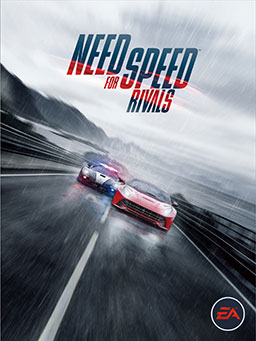

# Playstation
## 极品飞车
{ width="750" }
{ width="750" } 

## 评价

* 评分：7.5 / 10

* 我喜欢的点
    - 主题回归地下狂飙系列（什么时候能重制一下！）
    - 地图中的山路占比较多，在狭窄曲折的山路上漂移的手感很好
    - 雨夜的画面表现力很棒

我最早接触的且有较深印象的《极品飞车》作品是《极品飞车 III：热力追缉》，之后的每一作我几乎都玩过，《极品飞车》系列也是我“出必买”的游戏系列。顺便贴下我个人对《极品飞车》系列的排名：

* 第一位：极品飞车：全民公敌（2005）
    - 黑名单车手出场酷炫

* 第二位：极品飞车：飙风再起2 (2004)
    - 开放世界，夜景美丽

* 第三位：极品飞车：亡命狂飙 (2011)
    - 雪崩赛道封神，最后一战氛围十足

* 第四位：极品飞车 (2015)
    - 对地下狂飙系列最好的致敬

* 第五位：极品飞车：生存竞速 (2013)
    - 综合体验最好的警匪题材的《极品飞车》

* 特别：极品飞车：保时捷的荣耀 (2000)

