__2025/01/09__

__赶上从日本海吹来的超强冷空气, 天气不稳定, 时不时下雪, 主要是风超大!__
## 出云大社

- 从松江出发去出云, 乘坐的是一畑电车, 此外还有JR山阴本线可以选择

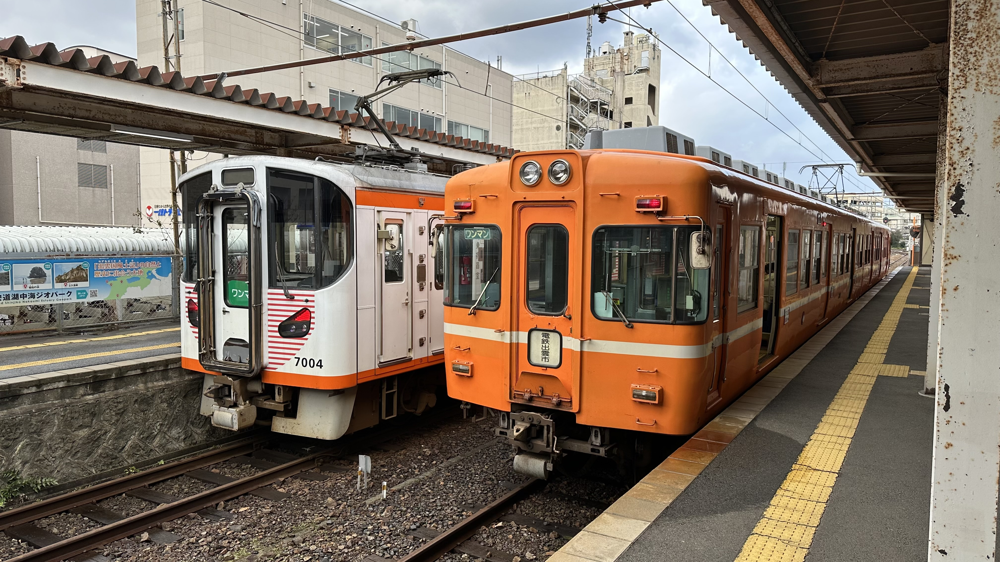

- 需要在川迹站下车乘坐前往出云大社的支线

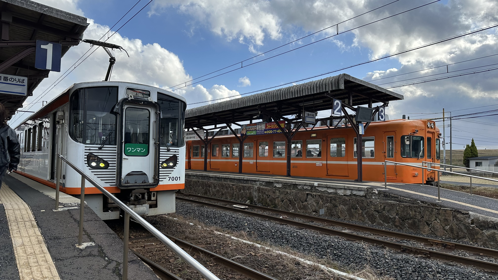

- 前往出云大社方向的车要新些, 还在车厢里遇见岛根县的吉祥物--岛根猫

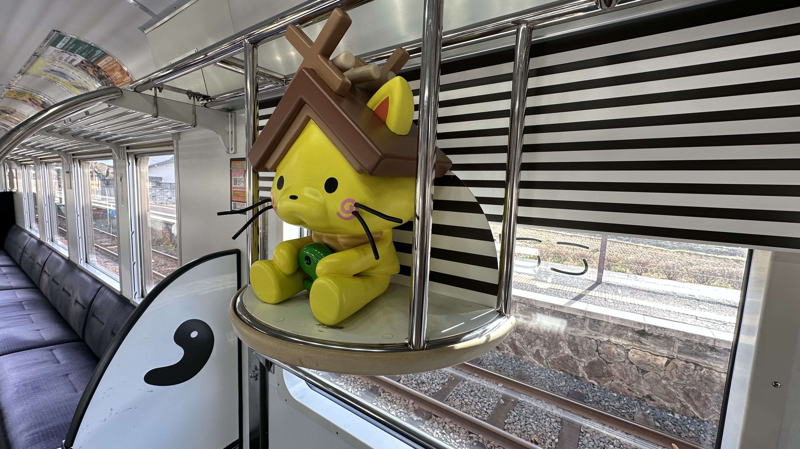

- 出云大社前站, 是一畑电车的专门站, 车站挺小

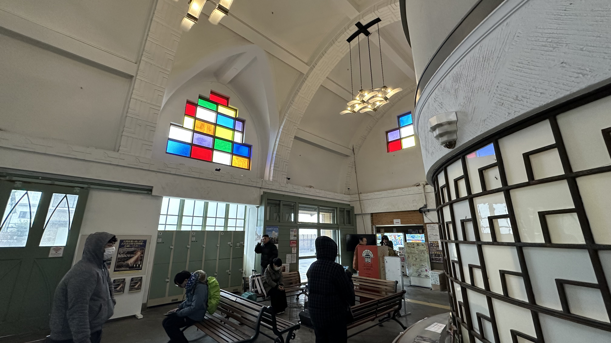

- 出站走路几分钟就到出云大社

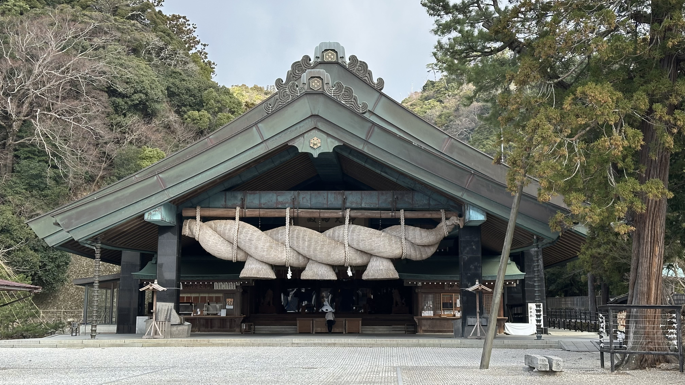

- 出云大社以超大的注连绳闻名, 站在下面的时候确实震撼

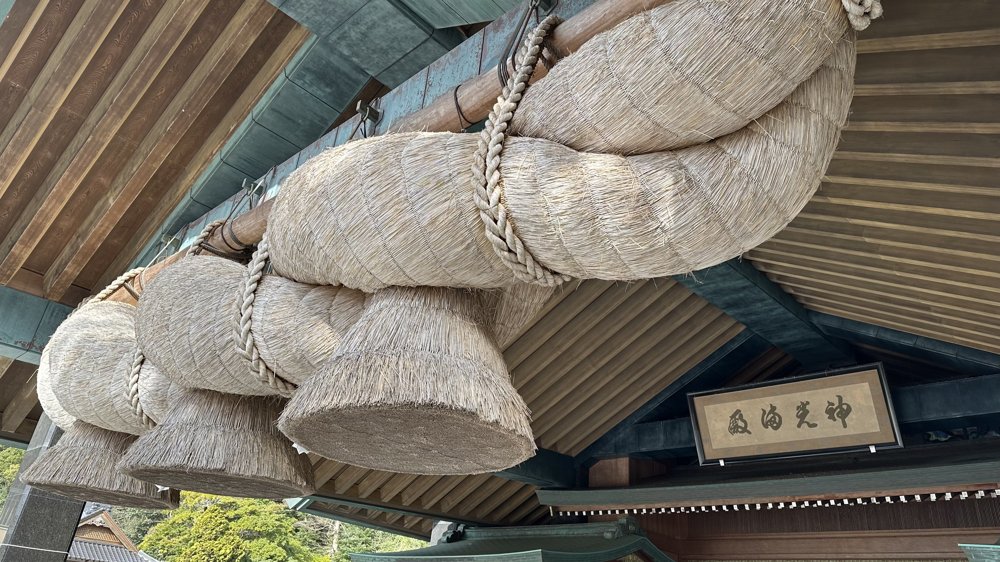

## 稻佐之滨

- 稻佐之滨旁边有座山, 山上有展望台, 当天风~太~大~了

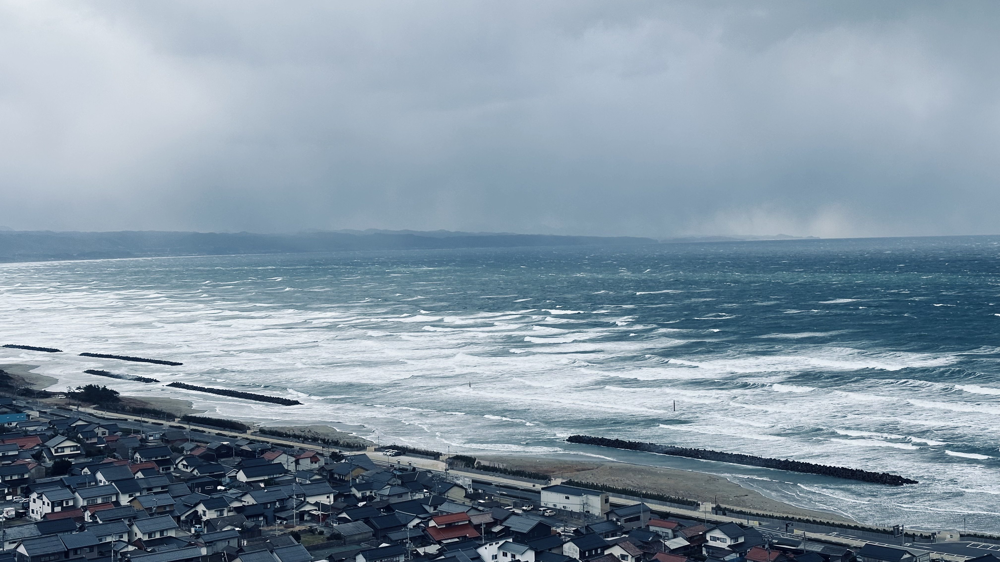
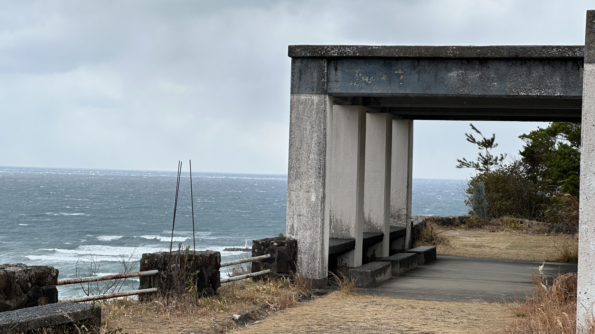

- 看看日本海海岸线, 风大浪大, 稻佐之滨看点是岩石上有个小祠堂

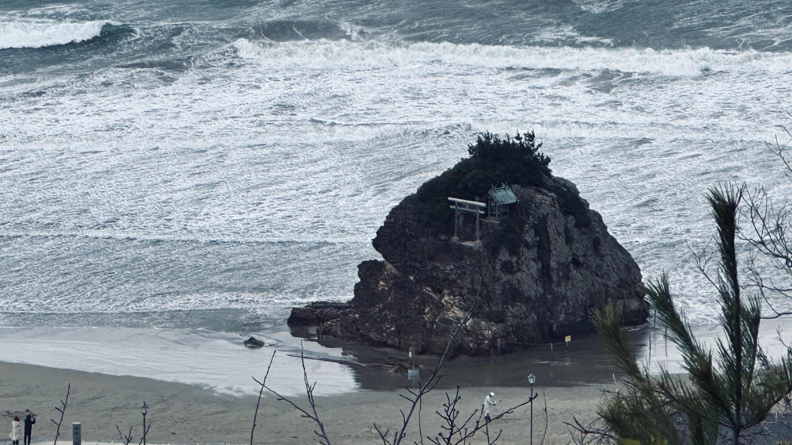

- 厚厚的云层中有阳光射下来, 俯瞰出云城区

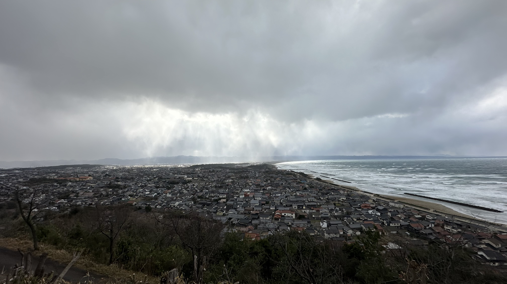

- 从海岸线回出云大社前车站, 经过空荡荡的小镇

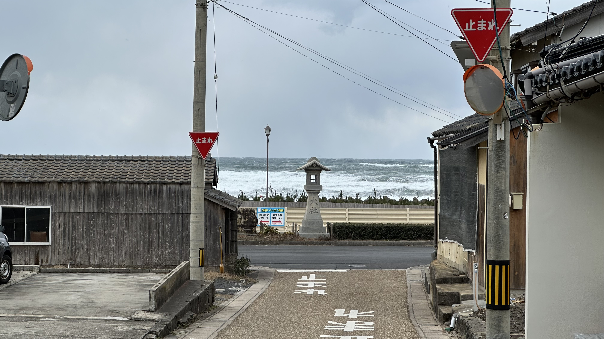
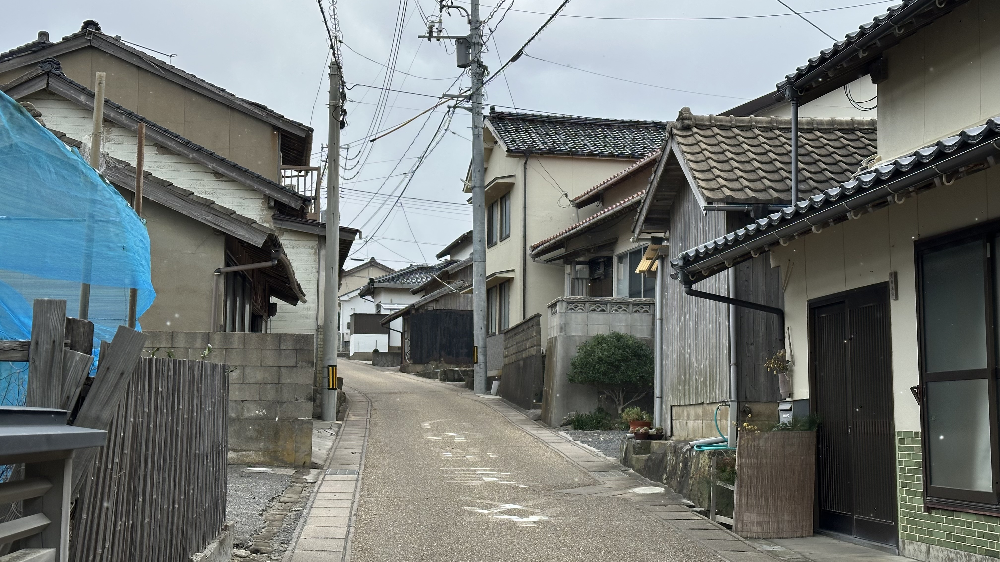

## JR出云市站

- 下雪的出云站前, 等待回大阪的高速巴士

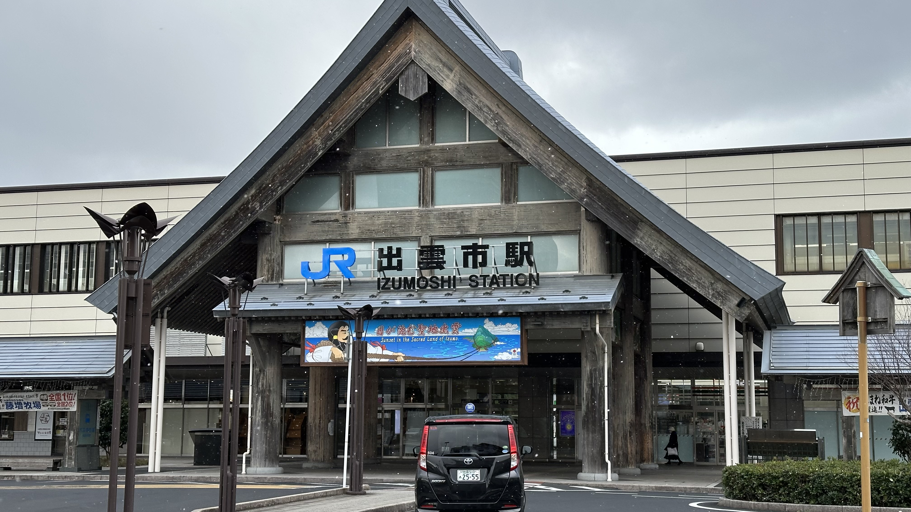

- 车站里吃点出云名物 (荞麦面+鱼糕+拉面), 荞麦面挺爽滑的, 拉面一般

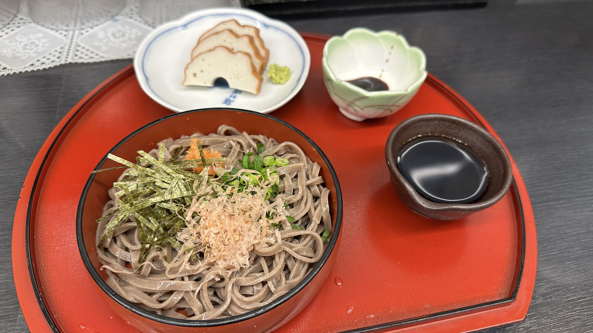

## 回程 (出云->大阪)

- 回去车程五个半小时, 停了三个服务区, 每次下车走走, 其实还行
- 下着雪也要出来走走

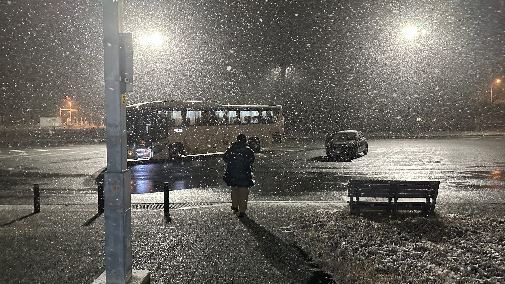

- 拜拜👋

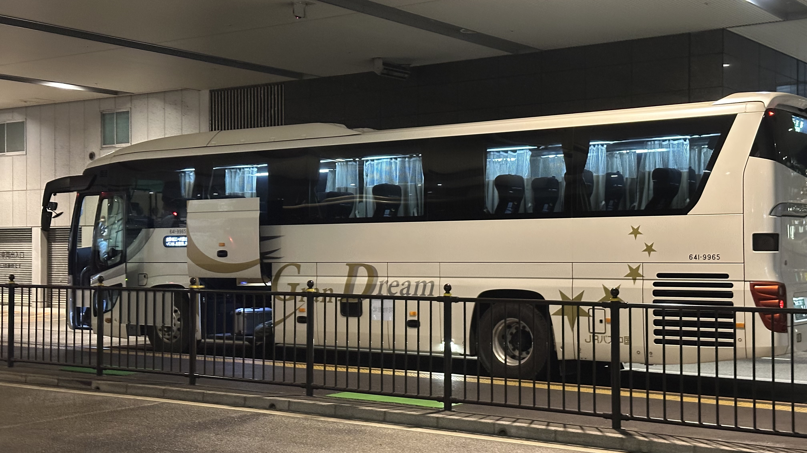