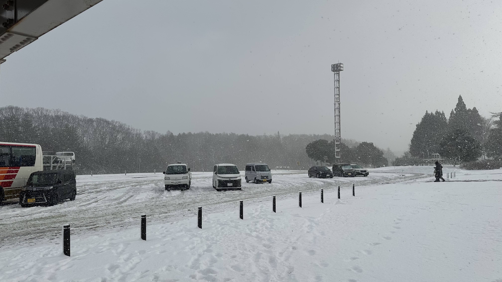

__2025/01/08__

__如果不是游戏方根书简, 我可能永远不会知道这座位于日本山阴的城市__

## 去程 (大阪->松江)

相较于电车, 高速巴士算是一个更有性价比的选择, 早上七点左右从大阪站出发, 全程四个多小时, 票价在4000-5000波动

- 座位在第一排的正中间, 视野不错, 一路上看风景, 四个多小时也不算无聊

- 第一个休息站, 清晨的景色不错

- 继续向山阴出发, 路上下起了雪, 一路上的景色变化也是十分奇妙

- 第二个休息站就完全被雪覆盖了

- 中午十一点半, 到达JR松江站 (显然不是上海松江哈哈)

__下车直奔宍道湖游览船售票处, 结果被告知冬季只有周末才出航, 松江城也因为当天的风雪被关闭__

## 松江城市闲逛

- 这条河从松江城市中心贯穿过去, 流向宍道湖

- 中午吃了天妇罗, 坐在吧台旁, 厨师会把刚做完的天妇罗放在面前的盘子里

- 河上有很多鸭子, 随着波浪上下浮动

<video controls>
  <source src="./IMG_2858.mp4" type="video/mp4">
  您的浏览器不支持视频播放。
</video>

- 远眺松江城

## 岛根县立美术馆

- 展品大多比较平淡, 但胜在票价便宜, 大学生只需要200日元

- 美术馆就坐落于宍道湖旁, 以落日景色而闻名

 

- 可惜当天云层很厚, 看不到夕阳了, 但云层色彩还挺好看

- 酒店就在河对面, 松江很小, 一天也就基本逛完

酒店旁边就是一畑电车的松江しんじ湖温泉站, 也是去往出云大社的电车线路